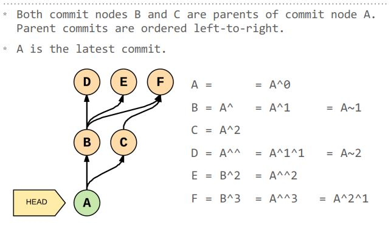

# Advanced Git

## Tips ;)

**Need to check where is your installation?**
`$ where git`

**Config new editor?** `$ git config --global core.editor <YOUR_EDITOR>`
For vs code use `code --wait`

**Using less on the command line**
| Next Page | f | Previous | b |
| :--------: | :--------: | :------------: | :-: |
| next match | n | previous match | p |
| search | /<_query_> | quit | q |

**Aliases and starting path**: edit the `.bash_profile` file with this format: `alias gadd='git add'` and add the starting path: `cd path/path/path`

## Table of contents

| [Tips](#tips) | [Aliases](#my-aliases) | [Commands](#commands) |     |
| :------------ | :--------------------- | :-------------------- | :-- |


## My aliases

To add aliases edit the `.bash_profile` file with this format: `alias gadd='git add'`

| Command              | Alias | Command                                         | Alias |
| :------------------- | :---- | :---------------------------------------------- | :---- |
| **git add**          | gadd  | **git stash apply**                             | sha   |
| **git commit -m**    | cm    | **git stash pop**                               | shp   |
| **git commit -a -m** | cma   | g**it stash list**                              | shl   |
| **git branch**       | br    | **git merge**                                   | mg    |
| **git checkout**     | co    | **git push -u**                                 | ph    |
| **git diff**         | df    | **git status**                                  | gs    |
| **stash**            | sh    | **'git log --oneline --decorate --graph --all** | blog  |

[Home][home]

## Commands

| [staging](#moving-files-in-&-out-of-staging-Area) | [stashing](#stashing)             | [taging](#taging)                 |
| :------------------------------------------------ | :-------------------------------- | :-------------------------------- |
| [Branching](#branching)                           | [Merging](#merging)               | [Loging](#loging)                 |
| [referencing](#referencing-commits)               | [show](#show)                     | [Diff](#diff)                     |
| [Checkout](#checkout)                             | [Reset](#reset)                   | [Revert](#revert)                 |
| [Clean](#clean)                                   | [Clone](#clone)                   | [Push](#push)                     |
| [Pull](#pull)                                     | [Conflicts](#conflicts)           | [Rebase & Amend](#rebase-&-amend) |
| [Forks & Remotes](#forks-&-remotes)               | [Github Hotkeys](#github-hotkeys) |

Forks & Remotes
Github Hotkeys

### Moving files in & out of staging Area

| add a file to the next commit: `git add <file>` | delete a file in the next commit: `git rm <file>` | rename a file in the next commit: `git mv <file>` | Interactive Commit `git add -p` |
| :--------------------------------------------- | :----------------------------------------------- | :----------------------------------------------- | :------------------------------ |


[Home][home]

### Stashing

| stash changes: `git stash`                                                    | list changes: `git stash list`                                                      | show the contents: `git stash show stash@{0}`                                 |
| :---------------------------------------------------------------------------- | :---------------------------------------------------------------------------------- | :---------------------------------------------------------------------------- |
| **apply last stash: `git stash apply`**                                       | **apply a specific stash: `git stash apply stash@{0}`**                             | **Keep untracked files: `kit stash --include-untracked`**                      |
| **Keep all files (even ignored ones!): `git stash all`**                       | **Name stashes for easy reference: `git stash save "WIP: making progress on foo"`** | **Start a new branch from a stash: `git stash branch <optional stash name>`** |
| **Grab a single file from a stash: `git checkout <stash name> -- <filename>`** | **Remove the last stash and applying changes: `git stash pop`**                     | **Remove the last stash: `git stash drop`**                                   |
| **Remove the _nth_ stash: `git stash drop stash@{n}`**                        | **Remove all stashes: `git stash clear`**                                           |

[Advanced Stashing Exercise](https://github.com/nnja/advanced-git/blob/master/exercises/Exercise2-StagingAndStashing.md)

[Home][home]

### Taging

| Lightweight Tags: `git tag my-first-commit`                                   | Annotated: `git tag -a <text, tipically version> -m <"a message">`         | list all tags: `git tag`                                          |
| :---------------------------------------------------------------------------- | :------------------------------------------------------------------------- | :---------------------------------------------------------------- |
| **List all tags, and what commit they’re pointing to: `git show-ref --tags`** | **List all the tags pointing at a commit: `git tag --points-at <commit>`** | **Looking at the tag, or tagged contents: `git show <tag-name>`** |

[Home][home]

### Branching

| Create a branch without switching to it: `git branch <name>`                     | create branch and move HEAD: `git checkout -b <name>` |
| :------------------------------------------------------------------------------- | :---------------------------------------------------- |
| **create branch based on commit: `git branch -b <name of new branch> <commit>`** | **rename current: `git branch -m <new name>`**        |

|**delete branch: `git branch -D <name>`**

[References Exercise](https://github.com/nnja/advanced-git/blob/master/exercises/Exercise3-References.md)

[Home][home]

### Merging

| Merge no fast forward: git merge --no-ff <branch> | turn onrecorded conflict resolution:`git config rerere.enabled true` (use `--global flag` to enable for all projects) | regular merge : `git merge <branch>` |
| :------------------------------------------------ | :------------------------------------------------------------------------------------------------------------------- | :----------------------------------- |


|Fraking out? no worries: `git merge abort`

[Exercises](https://github.com/nnja/advanced-git/blob/master/exercises/Exercise4-MergingAndReReRe.md)

[List of Commands](#commands)

[Home][home]

### Loging

| Show branches , color coded and one line: `git log --oneline --decorate --graph --all`   | show log from a specific point (i.e. "yesterday" "two weeks") : `git log --since="yesterday"`                       | Log files that have been moved or renamed: `git log --name-status --follow -- <file>` |
| :--------------------------------------------------------------------------------------- | :------------------------------------------------------------------------------------------------------------------ | :----------------------------------------------------------------------------------- |
| **search for commit messages that match a regular expression: `git log —grep <regexp>`** | **Selectively include or exclude files that have been: (A)dded, (D)eleted, (M)odified & more… `git log diff-filter`** |

`git log —grep <regexp>` can be matched with other flags: `git log --grep=mail --author=nina --since=2.weeks`

### Referencing Commits

`^` or `^n` with no args: == `^1`: the first parent commit.

`n`= the nth parent commit.

`~` or `~n` with no args: == `~1`: the first commit back, following 1st parent.

`n`: number of commits back, following only 1st parent.



[List of Commands](#commands)

[Home][home]

### Show

| show commit and contents; `git show <commit>` | show files changed in commit: `git show <4b2b90e> --stat <optional; --oneline`> | look at a file from another commit: `git show <commit>:<file>` |
| :-------------------------------------------- | :------------------------------------------------------------------------------ | :------------------------------------------------------------- |


[List of Commands](#commands)

[Home][home]

### Diff

| unstaged changes : `git diff`                                                          | staged changes: `git diff --staged` | show which branches are merged with master, and can be cleaned up: `git branch --merged master` |
| :------------------------------------------------------------------------------------- | :---------------------------------- | :---------------------------------------------------------------------------------------------- |
| **Show which branches aren’t merged with master yet: `git branch --no-merged master`** |

[Exercises](https://github.com/nnja/advanced-git/blob/master/exercises/Exercise5-HistoryAndDiffs.md)

[List of Commands](#commands)

[Home][home]

### Checkout

| Checkout a file from a specific commit (copies both working and staging): `git checkout <commit> -- <file_path>` | Restore a deleted file :`git checkout <deleting_commit>^ -- <file_path>` |
| :------------------------------------------------------------------------------------------------------------- | :---------------------------------------------------------------------- |


[List of Commands](#commands)

[Home][home]

### reset

| `git reset --soft HEAD<reference>` | `git reset --mixed HEAD<reference>` | `git reset --hard HEAD<reference>` |
| :--------------------------------- | :---------------------------------- | :--------------------------------- |
| `git reset -- <file>`              | `git reset <commit> -- <file>`      | `git reset ORIG_HEAD`              |

[List of Commands](#commands)

[Home][home]

### Revert

`git revert <commit>`

[List of Commands](#commands)

[Home][home]

### Clean

| See what would be deleted:`git clean --dry-run` | force deletion: `git clean -f` | delete the directory : `git clean -d -f` |
| :---------------------------------------------- | :----------------------------- | :--------------------------------------- |


[Exercises for reset, revert, clean and checkout](https://github.com/nnja/advanced-git/blob/master/exercises/Exercise6-FixingMistakes.md)

[List of Commands](#commands)

[Home][home]

### Clone

| clone project: `git clone <https>` | clone and change name: `git clone <https> <name>` | check remote points : `git remote -v` |
| :--------------------------------- | :------------------------------------------------ | :------------------------------------ |


|sote credentials when using https: `git config --global credential.helper "cache --timeout=<time in seconds>`

You have the option of choosing a different protocol. The available protocols for any Git remote are: Local, Git,HTTP/HTTPS and SSH.

[List of Commands](#commands)

[Home][home]

### Push

| push to specific branch: `git push <remote name>` | push from | push a specific branh (regardless of HEAD) to a remote branch of same name (if it doesnt exist, it creates it): `git push <remote name> <branch to push>` |
| :------------------------------------------------ | :-------- | :-------------------------------------------------------------------------------------------------------------------------------------------------------- |


|push a specific branch to a specific remote: `git push <remote_name> <local_branch>:<remote_branch>`

[List of Commands](#commands)

[Home][home]

### Pull

| Download changes: `git fetch <optional: remote_name>` | fetch and merge current active branch: `git pull <rtemote name>` | download code from `branch_name` branch of the `remote_name` remote branch, then merge it with the current active branch: `git pull remote_name branch_name` | Download specific branch from a specific remote and merge with specific local: `git pull <remote_name> <local_branch>:<remote_branch>` |
| :---------------------------------------------------- | :--------------------------------------------------------------- | :----------------------------------------------------------------------------------------------------------------------------------------------------------- | :------------------------------------------------------------------------------------------------------------------------------------- |


Following a fetch, to update your local branch you need to merge it with the appropriate branch from the remote. For instance, if you’re planning to update the local master branch with the remote’s master branch, run the following command: `git merge origin/master`. A shorter way of updating the local branch by downloading and merging a remote branch is by using pull, note that all pulls are fast forward.

[List of Commands](#commands)

[Home][home]

### Conflicts

```
<<<<<<< HEAD
CONSTANT = 7
=======
CONSTANT = 9
>>>>>>> friend_branch

def add_constant(number):
    return CONSTANT + number
```

The lines between `<<<<<<< HEAD` and `=======` contain your version of the part of the file, whereas the lines between `=======` and `>>>>>>>` friend_branch contain the part of the file that is present in the friend_branch. After you’ve resolved the conflicts, you should stage the changed files for commit.

[List of Commands](#commands)

[Home][home]

### Rebase & Amend

`rebase` avoids loops in the project history, the process of “rebasing” is a way of rewriting the history of a branch by moving it to a new “base” commit.

If you’re rebasing a `master` into `new_feature`, the new commits in master are put before the new commits in new_feature that are not common to master. To do so, run the following command from the new_feature branch:

`git rebase master`

Interactive rebase: `git rebase -i <commit_to_fix>^`

Rebase Options:

| pick: keep this commit                                                                      | reword: keep the commit, just change the message                                       | edit: keep the commit, but stop to edit more than the message            |
| :------------------------------------------------------------------------------------------ | :------------------------------------------------------------------------------------- | :----------------------------------------------------------------------- |
| **squash**:combine this commit with the previous one. stop to edit the message              | **fixup**: combine this commit with the previous one. keep the previous commit message | **exec**: run the command on this line after picking the previous commit |
| **drop**: remove the commit (tip: if you remove this line, the commit will be dropped too!) |

#### Important: Working in a Team

If you’re working in a team, you should first checkout to master, pull from the upstream branch to update your master with the latest commits, and then switch back to new_feature before running the above command.

This can also be accomplished by the following:

`git merge --rebase master`


[Exercises](https://github.com/nnja/advanced-git/blob/master/exercises/Exercise7-RebaseAndAmend.md)

### Forks & Remotes

### Github Hotkeys

Press `?` on any github.com page for a list of shortcuts then, hit ‘Show All’.

| Repositories          | Source Code Browsing        |
| :-------------------- | :-------------------------- |
| Go to code: `g+c`     | file finder: `t`            |
| go to issues: `g+i`   | jump line: `l`              |
| pull Requests: `g+p`  | switch branch/tag           |
| go to projects: `g+b` | expand URL: `y`             |
| go to wiki: `g+w`     | show/hide inline notes: `i` |

Tips:

When viewing code on github, you’re looking at latest version on a particular branch i.e. github.com/nnja/tweeter/blob/master/

If you want to send someone a link to a particular set of changes, and guarantee that they’ll see the same code you were looking at, hit ‘y’ when visiting the file on github. This will link to the commit instead of the branch!

[home]: #table-of-contents
