# Advanced Git

## Tips ;)

**Need to check where is your installation?**
`$ where git`

**Config new editor?** `$ git config --global core.editor <YOUR_EDITOR>`
For vs code use `code --wait`

**Using less on the command line**
| Next Page | f | Previous | b |
| :--------: | :--------: | :------------: | :-: |
| next match | n | previous match | p |
| search | /<_query_> | quit | q |

**Aliases and starting path**: edit the `.bash_profile` file with this format: `alias gadd='git add'` and add the starting path: `cd path/path/path`

## Table of contents

| [Tips](#tips) | [Aliases](#my-aliases) | [Commands](#commands) |     |
| :------------ | :--------------------- | :-------------------- | :-- |


## My aliases

To add aliases edit the `.bash_profile` file with this format: `alias gadd='git add'`

| Command              | Alias | Command                                         | Alias |
| :------------------- | :---- | :---------------------------------------------- | :---- |
| **git add**          | gadd  | **git stash apply**                             | sha   |
| **git commit -m**    | cm    | **git stash pop**                               | shp   |
| **git commit -a -m** | cma   | g**it stash list**                              | shl   |
| **git branch**       | br    | **git merge**                                   | mg    |
| **git checkout**     | co    | **git push -u**                                 | ph    |
| **git diff**         | df    | **git status**                                  | gs    |
| **stash**            | sh    | **'git log --oneline --decorate --graph --all** | blog  |

[Home][home]

## Commands

| [staging](#moving-files-in-&-out-of-staging-Area) | [stashing](#stashing)             | [taging](#taging)                 |
| :------------------------------------------------ | :-------------------------------- | :-------------------------------- |
| [Branching](#branching)                           | [Merging](#merging)               | [Loging](#loging)                 |
| [referencing](#referencing-commits)               | [show](#show)                     | [Diff](#diff)                     |
| [Checkout](#checkout)                             | [Reset](#reset)                   | [Revert](#revert)                 |
| [Clean](#clean)                                   | [Clone](#clone)                   | [Push](#push)                     |
| [Pull](#pull)                                     | [Conflicts](#conflicts)           | [Rebase & Amend](#rebase-&-amend) |
| [Forks & Remotes](#forks-&-remotes)               | [Github Hotkeys](#github-hotkeys) |

Forks & Remotes
Github Hotkeys

### Moving files in & out of staging Area

| add a file to the next commit: `git add <file>` | delete a file in the next commit: `git rm <file>` | rename a file in the next commit: `git mv <file>` | Interactive Commit `git add -p` |
| :--------------------------------------------- | :----------------------------------------------- | :----------------------------------------------- | :------------------------------ |


[Home][home]

### Stashing

| stash changes: `git stash`                                                    | list changes: `git stash list`                                                      | show the contents: `git stash show stash@{0}`                                 |
| :---------------------------------------------------------------------------- | :---------------------------------------------------------------------------------- | :---------------------------------------------------------------------------- |
| **apply last stash: `git stash apply`**                                       | **apply a specific stash: `git stash apply stash@{0}`**                             | **Keep untracked files: `kit stash --include-untracked`**                      |
| **Keep all files (even ignored ones!): `git stash all`**                       | **Name stashes for easy reference: `git stash save "WIP: making progress on foo"`** | **Start a new branch from a stash: `git stash branch <optional stash name>`** |
| **Grab a single file from a stash: `git checkout <stash name> -- <filename>`** | **Remove the last stash and applying changes: `git stash pop`**                     | **Remove the last stash: `git stash drop`**                                   |
| **Remove the _nth_ stash: `git stash drop stash@{n}`**                        | **Remove all stashes: `git stash clear`**                                           |

[Advanced Stashing Exercise](https://github.com/nnja/advanced-git/blob/master/exercises/Exercise2-StagingAndStashing.md)

[Home][home]

### Taging

| Lightweight Tags: `git tag my-first-commit`                                   | Annotated: `git tag -a <text, tipically version> -m <"a message">`         | list all tags: `git tag`                                          |
| :---------------------------------------------------------------------------- | :------------------------------------------------------------------------- | :---------------------------------------------------------------- |
| **List all tags, and what commit they’re pointing to: `git show-ref --tags`** | **List all the tags pointing at a commit: `git tag --points-at <commit>`** | **Looking at the tag, or tagged contents: `git show <tag-name>`** |

[Home][home]

### Branching

| Create a branch without switching to it: `git branch <name>`                     | create branch and move HEAD: `git checkout -b <name>` |
| :------------------------------------------------------------------------------- | :---------------------------------------------------- |
| **create branch based on commit: `git branch -b <name of new branch> <commit>`** | **rename current: `git branch -m <new name>`**        |

|**delete branch: `git branch -D <name>`**

[References Exercise](https://github.com/nnja/advanced-git/blob/master/exercises/Exercise3-References.md)

[Home][home]

### Merging

| Merge no fast forward: git merge --no-ff <branch> | turn onrecorded conflict resolution:`git config rerere.enabled true` (use `--global flag` to enable for all projects) | regular merge : `git merge <branch>` |
| :------------------------------------------------ | :------------------------------------------------------------------------------------------------------------------- | :----------------------------------- |


|Fraking out? no worries: `git merge abort`

[Exercises](https://github.com/nnja/advanced-git/blob/master/exercises/Exercise4-MergingAndReReRe.md)

[List of Commands](#commands)

[Home][home]

### Loging

| Show branches , color coded and one line: `git log --oneline --decorate --graph --all`   | show log from a specific point (i.e. "yesterday" "two weeks") : `git log --since="yesterday"`                       | Log files that have been moved or renamed: `git log --name-status --follow -- <file>` |
| :--------------------------------------------------------------------------------------- | :------------------------------------------------------------------------------------------------------------------ | :----------------------------------------------------------------------------------- |
| **search for commit messages that match a regular expression: `git log —grep <regexp>`** | **Selectively include or exclude files that have been: (A)dded, (D)eleted, (M)odified & more… `git log diff-filter`** |

`git log —grep <regexp>` can be matched with other flags: `git log --grep=mail --author=nina --since=2.weeks`

### Referencing Commits

`^` or `^n` with no args: == `^1`: the first parent commit.

`n`= the nth parent commit.

`~` or `~n` with no args: == `~1`: the first commit back, following 1st parent.

`n`: number of commits back, following only 1st parent.


[List of Commands](#commands)

[Home][home]

### Show

| show commit and contents; `git show <commit>` | show files changed in commit: `git show <4b2b90e> --stat <optional; --oneline`> | look at a file from another commit: `git show <commit>:<file>` |
| :-------------------------------------------- | :------------------------------------------------------------------------------ | :------------------------------------------------------------- |


[List of Commands](#commands)

[Home][home]

### Diff

| unstaged changes : `git diff`                                                          | staged changes: `git diff --staged` | show which branches are merged with master, and can be cleaned up: `git branch --merged master` |
| :------------------------------------------------------------------------------------- | :---------------------------------- | :---------------------------------------------------------------------------------------------- |
| **Show which branches aren’t merged with master yet: `git branch --no-merged master`** |

[Exercises](https://github.com/nnja/advanced-git/blob/master/exercises/Exercise5-HistoryAndDiffs.md)

[List of Commands](#commands)

[Home][home]

### Checkout

| Checkout a file from a specific commit (copies both working and staging): `git checkout <commit> -- <file_path>` | Restore a deleted file :`git checkout <deleting_commit>^ -- <file_path>` |
| :------------------------------------------------------------------------------------------------------------- | :---------------------------------------------------------------------- |


[List of Commands](#commands)

[Home][home]

### reset

| `git reset --soft HEAD<reference>` | `git reset --mixed HEAD<reference>` | `git reset --hard HEAD<reference>` |
| :--------------------------------- | :---------------------------------- | :--------------------------------- |
| `git reset -- <file>`              | `git reset <commit> -- <file>`      | `git reset ORIG_HEAD`              |

[List of Commands](#commands)

[Home][home]

### Revert

`git revert <commit>`

[List of Commands](#commands)

[Home][home]

### Clean

| See what would be deleted:`git clean --dry-run` | force deletion: `git clean -f` | delete the directory : `git clean -d -f` |
| :---------------------------------------------- | :----------------------------- | :--------------------------------------- |


[Exercises for reset, revert, clean and checkout](https://github.com/nnja/advanced-git/blob/master/exercises/Exercise6-FixingMistakes.md)

[List of Commands](#commands)

[Home][home]

### Clone

| clone project: `git clone <https>` | clone and change name: `git clone <https> <name>` | check remote points : `git remote -v` |
| :--------------------------------- | :------------------------------------------------ | :------------------------------------ |


|sote credentials when using https: `git config --global credential.helper "cache --timeout=<time in seconds>`

You have the option of choosing a different protocol. The available protocols for any Git remote are: Local, Git,HTTP/HTTPS and SSH.

[List of Commands](#commands)

[Home][home]

### Push

| push to specific branch: `git push <remote name>` | push from | push a specific branh (regardless of HEAD) to a remote branch of same name (if it doesnt exist, it creates it): `git push <remote name> <branch to push>` |
| :------------------------------------------------ | :-------- | :-------------------------------------------------------------------------------------------------------------------------------------------------------- |


|push a specific branch to a specific remote: `git push <remote_name> <local_branch>:<remote_branch>`

[List of Commands](#commands)

[Home][home]

### Pull

| Download changes: `git fetch <optional: remote_name>` | fetch and merge current active branch: `git pull <rtemote name>` | download code from `branch_name` branch of the `remote_name` remote branch, then merge it with the current active branch: `git pull remote_name branch_name` | Download specific branch from a specific remote and merge with specific local: `git pull <remote_name> <local_branch>:<remote_branch>` |
| :---------------------------------------------------- | :--------------------------------------------------------------- | :----------------------------------------------------------------------------------------------------------------------------------------------------------- | :------------------------------------------------------------------------------------------------------------------------------------- |


Following a fetch, to update your local branch you need to merge it with the appropriate branch from the remote. For instance, if you’re planning to update the local master branch with the remote’s master branch, run the following command: `git merge origin/master`. A shorter way of updating the local branch by downloading and merging a remote branch is by using pull, note that all pulls are fast forward.

[List of Commands](#commands)

[Home][home]

### Conflicts

```
<<<<<<< HEAD
CONSTANT = 7
=======
CONSTANT = 9
>>>>>>> friend_branch

def add_constant(number):
    return CONSTANT + number
```

The lines between `<<<<<<< HEAD` and `=======` contain your version of the part of the file, whereas the lines between `=======` and `>>>>>>>` friend_branch contain the part of the file that is present in the friend_branch. After you’ve resolved the conflicts, you should stage the changed files for commit.

[List of Commands](#commands)

[Home][home]

### Rebase & Amend

[List of Commands](#commands)

[Home][home]

#### Important: Working in a Team

If you’re working in a team, you should first checkout to master, pull from the upstream branch to update your master with the latest commits, and then switch back to new_feature before running the above command.

This can also be accomplished by the following:

`git merge --rebase master`


[Exercises](https://github.com/nnja/advanced-git/blob/master/exercises/Exercise7-RebaseAndAmend.md)

[List of Commands](#commands)

[Home][home]

### Forks & Remotes

[List of Commands](#commands)

[Home][home]

### Github Hotkeys

Press `?` on any github.com page for a list of shortcuts then, hit ‘Show All’.

| Repositories          | Source Code Browsing        |
| :-------------------- | :-------------------------- |
| Go to code: `g+c`     | file finder: `t`            |
| go to issues: `g+i`   | jump line: `l`              |
| pull Requests: `g+p`  | switch branch/tag           |
| go to projects: `g+b` | expand URL: `y`             |
| go to wiki: `g+w`     | show/hide inline notes: `i` |

Tips:

When viewing code on github, you’re looking at latest version on a particular branch i.e. github.com/nnja/tweeter/blob/master/

If you want to send someone a link to a particular set of changes, and guarantee that they’ll see the same code you were looking at, hit ‘y’ when visiting the file on github. This will link to the commit instead of the branch!

[List of Commands](#commands)

[Home][home]

## Fixing Mistakes

With so many different ways to fix mistakes in git, and these having subtle differences between them as well different behaviours based on the flags used, it can be really confusing to know which one to use when and how.

To choose the right tool, we need to properly understand the thee areas of git where code "lives": working area, staging area and repository, as well as the ways in which we can move data between them.

**Remember** that the staging area is never empty, its a copy, itsa copy of the current commit, it has all the files and the SHA of the files in the current commit.

[Home][home]

### Git Checkout

The first way is with **`git checkout`**, which allows us to **restore working tree files or switch branches**. The behavior depends on the parameters.

When we checkout a branch (`git checkout <branch name`>) the following happens; 1. Change HEAD to point to the new branch 1. Copy the commit snapshot to the staging area 1. Update the working area with the branch contents

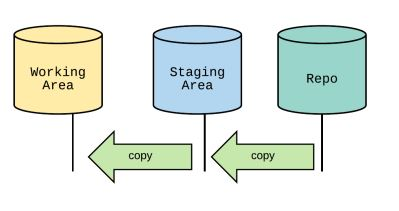

[Home][home]

#### Checkout file

When we checkout a file (`git checkout -- <file_path>`) you replace the working area copy with the version from the current staging area. Git suggest you use this when you want to replace the file contents of your working area with the clean files of the repo.

<p align="center">
    
</p>

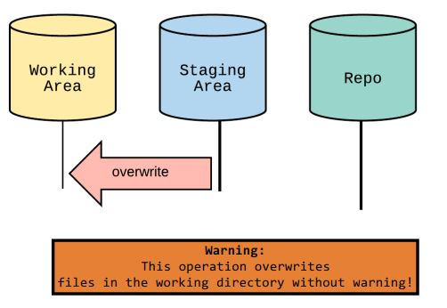

[Home][home]

#### `Checkout <commit> -- <file>`

When we checkout from a specific commit using `git checkout <commit> -- <file_path>` git:

1. Updates the staging area to match the commit.
1. Updates the working area to match the staging area.

<p align="center">
    
</p>

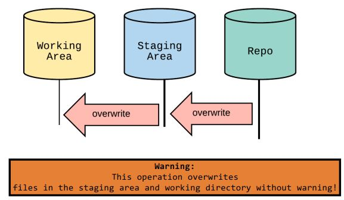

**Tip:** you can restore a deleted file this way: `git checkout <deleting_commit>^ -- <file_path>`

[Home][home]

### Git Clean

Git clean will clear your working area by deleting untracked files. Use the `—dry-run` flag to see what would be deleted and the `-f flag` to do the deletion. The `-d` flag will clean directories.

 <p align="center">
    
</p>

**Cant be undone!!**

[Home][home]

### Git Reset

Reset is another performs different actions depending on the arguments and if its run ith/without path. The main difference between `checkout` and `reset`and is that the former will move the head but leave the branch as it is, whereas the second moves the HEAD and the branch reference.

For commits this:

-   Moves the HEAD pointer and optionally modifies files .

For file paths:

-   Does not move the HEAD pointer, it just modifies files.

There are three options, `soft`, `mixed`(the default) and `hard`

[Home][home]

#### Git Reset Soft

`git reset --soft HEAD~`

Not used very frequently but is the first step of every `git reset` operation; all it does is move the head pointer.

**Example:**

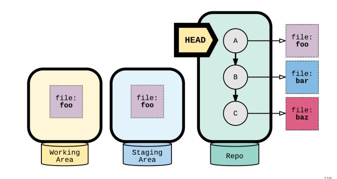

**Result:**

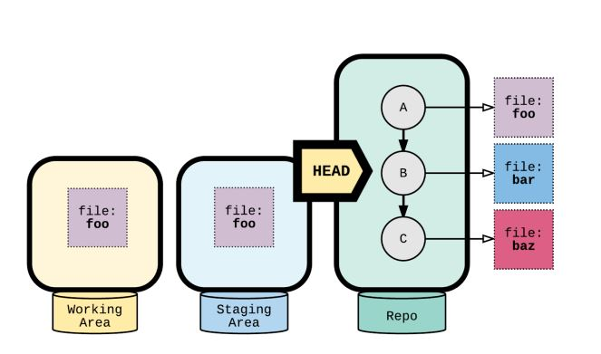

All it does is point to the previous commit (because of `HEAD~`). `A` is technically still there but at this point is a dangling commit, any commit made after this point will remove any reference to `A`.

[Home][home]

#### Git Reset Mixed

`git reset —mixed`

This is the default operation, it moves the head and then it copies to the staging area the file from the commit the head is pointing to.

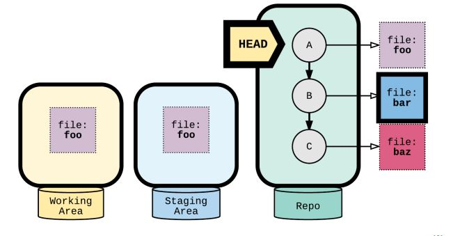

**Result:**

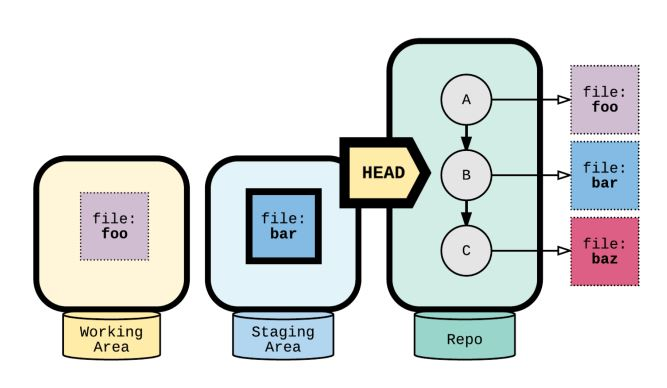

[Home][home]

#### Git Reset Hard

`git reset --hard HEAD`

It goes through the steps of `soft` and `mixed` and then copies the file from the staging to the working area.

<p align="center">
    
</p>

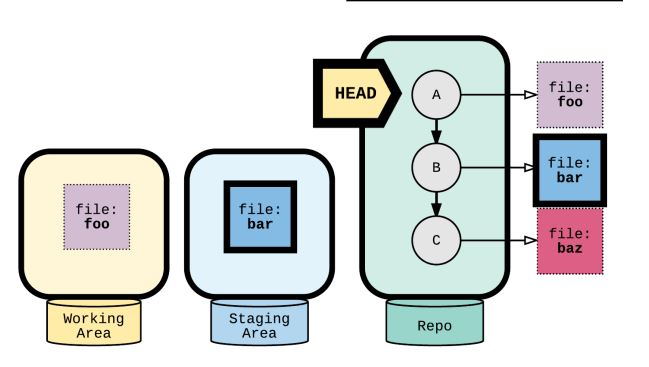

Result:

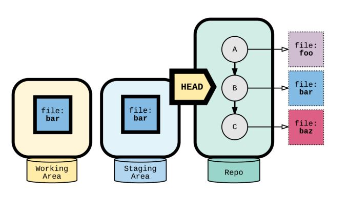

[Home][home]

#### Git reset \<commit> cheat sheet

1. Move HEAD and current branch
2. Reset the staging area
3. Reset the working area

`--soft` = (1)

`--mixed` =(1) & (2) (default)

`--hard` = (1) & (2) & (3)

[Home][home]

#### Git Reset File

`git reset <file>`

Doesn't move the head pointer but it does the same thing as a `mixed` reset, it copies the file from the commit to the staging area

<p align="center">
    
</p>

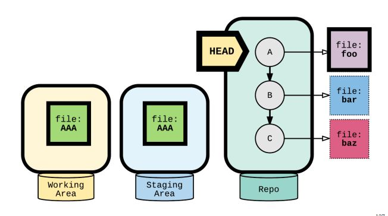

Result

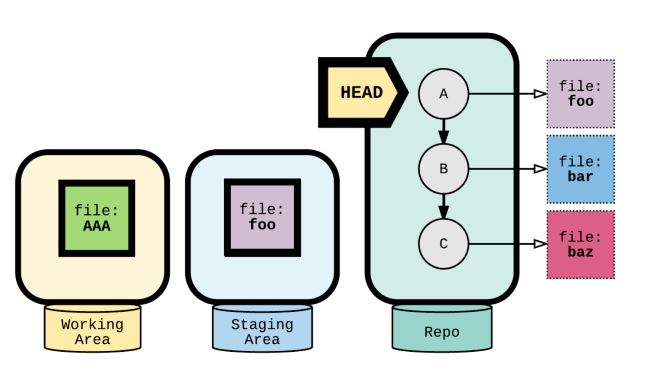

If we do it form a commit using `git reset <commit> -- <file>` you are telling git to take x file from x commit (in this example c) and put it in the staging area. This does not work with flags, it only does one thing!

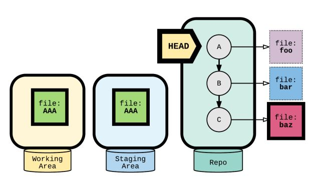

Result

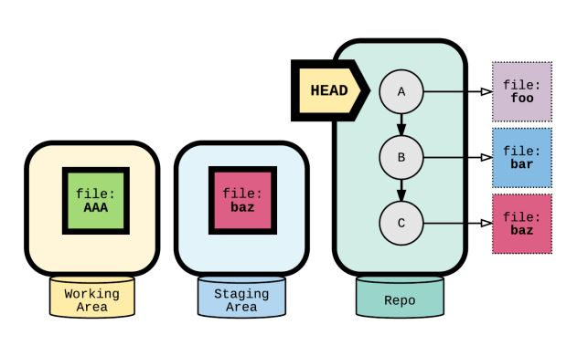

[Home][home]

### Recovering from a reset gone wrong?

Use `git reset ORIG_HEAD`

[Home][home]

### Git Revert; the "safe" reset

`git revert <commit>`

Git revert creates a new commit that introduces the opposite
changes from the specified commit. The original commit stays in the repository.

Tip: Use revert if you’re undoing a commit that has already been
shared. Revert does not change history.

[Home][home]

[home]: #table-of-contents

## Understanding Rebase and Amend

### Amend

A quick and easy way to make changes to the previous commit.

`git commit --amend`

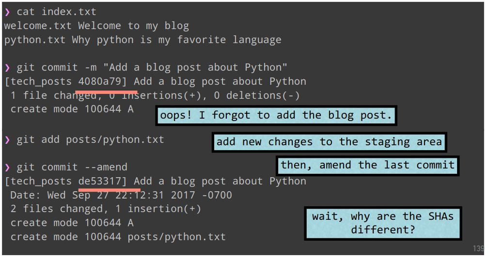

**The SHAs are different because they are based on the content of the commits, in other words, commits can´t be edited.**

### Rebase

In its basic use, `git rebase master` is a way to modify our commit history, it gives a commit a new parent. You use it to bring your branch up to date with the master in cases in which the master has diverged.

However, the true power of rebase comes into light when we use interactive rebase (**`git rebase -i <commit_tostart-fixing_from>^`**), which allows us to edit, remove, combine, re-order and insert commits **before** they are "replayed" back on top of HEAD.

**Note that you must also specify its parent with `^`**

Interactive rebase opens an editor with a list of "todos" in the format of: `<command> <commit> <commit msg>`. Git will pick the commits in the specified order, or stop to take action when editing or a conflict occurs.

| pick: keep this commit                                                                      | reword: keep the commit, just change the message                                       | edit: keep the commit, but stop to edit more than the message                                      |
| :------------------------------------------------------------------------------------------ | :------------------------------------------------------------------------------------- | :------------------------------------------------------------------------------------------------- |
| **squash**:combine this commit with the previous one. stop to edit the message              | **fixup**: combine this commit with the previous one. keep the previous commit message | **exec**: run the command on this line after picking the previous commit (for example run a test!) |
| **drop**: remove the commit (tip: if you remove this line, the commit will be dropped too!) |

**Example: USE REBASE TO SPLIT COMMITS**
Editing a commit can also split it up into multiple commits!

1. Start an interactive rebase with rebase -i
2. mark the commit with an edit
3. git reset HEAD^
4. git add
5. git commit
6. repeat (4) & (5) until the working area is clean!
7. git rebase --continue

**Example: amend an arbitrary commit**

1. git add new files
2. git commit --fixup <SHA>
3. this creates a new commit, the message starts with ‘fixup!’
4. git rebase -i --autosquash <SHA>^
5. git will generate the right todos for you! just save and quit.


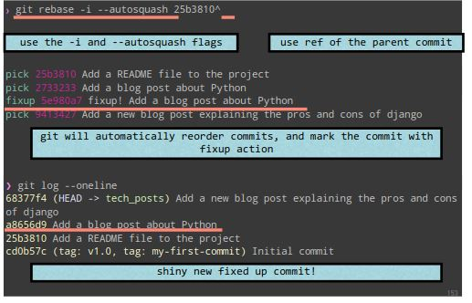

**Example: run a command with exec**

`git rebase -i —exec “run-tests” <commit>`

There are 2 options for exec:

1. add it as a command when doing interactive rebase
2. use it as a flag when rebasing

When used as a flag, the command specified by exec will run after every commit is applied,this can be used to run tests. The rebase will stop if the command fails, giving you a chance to fix what’s wrong.

TODO:

-   [ ] shortcuts for rebase /amend
-   [x] Explanation for rebase / amend
-   [ ] Link new content to table of contents
